  
  
  

  

  

<picture>
  <source media="(prefers-color-scheme: dark)" srcset="https://raw.githubusercontent.com/vijayy1510/vijayy1510/output/snake-dark.svg" />
  <source media="(prefers-color-scheme: light)" srcset="https://raw.githubusercontent.com/vijayy1510/vijayy1510/output/snake-light.svg" />
  
</picture>

  <code>// every commit is a step forward: thanks for stopping by ✦</code>
   
  

